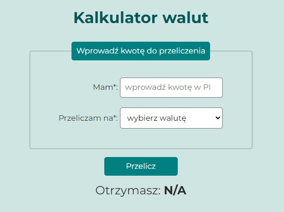

# Currency Converter
created by Radek Bubienko

## Demo
https://radekbubienko.github.io/currency-converter/

## Description
This Site created while learning programming at the **YouCode** school.
Simple currency converter in Polish. You can convert Polish zloty to US dollar, Euro and British pound.

## Languages
- HTML
- CSS
- JavaScript
- BEM
- ES6+
